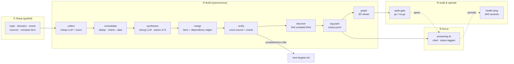

<div align="center">

# veritas

**Build an evidence-tracked knowledge corpus, answering workflow, and reviewable dependency graph from mixed
sources.**

[](https://github.com/Favoritchannel/veritas/actions/workflows/ci.yml)
[](https://github.com/Favoritchannel/veritas/actions/workflows/codeql.yml)
[](LICENSE)
[](package.json)
[](#project-status)

veritas is a small, provider-flexible Node.js reference implementation. It turns source material into a claim ledger,
a queryable corpus, candidate cross-source relationships for expert review, and a self-contained 3D dependency graph.
Run it stage by stage or finish with a local go/no-go structural audit.

[Quickstart](#quickstart) · [How it works](#how-it-works) · [The truth ledger](#the-truth-ledger) ·
[Add a source](#add-your-own-source-90-seconds) · [Guided vs autonomous](#two-ways-to-run) ·
[Security](#security--deployment-safety) · [Roadmap](docs/production-roadmap.md) · [Cost](#cost-model) · [Docs](docs/)

</div>

---

## Project status

> **Alpha / reference implementation.** The current CLI demonstrates pipeline structure and local artifact checks. A
> local `GO` does not certify factuality, source independence, corpus freshness, prompt-injection resistance, tenant
> isolation, or production readiness. Status labels are provisional signals produced by the current rules. Review the
> [known limitations and production roadmap](docs/production-roadmap.md) before relying on results.

## What you build with veritas

veritas is a **reusable template**, not a hosted service and not a prebuilt knowledge base. Bring a topic, mixed
sources, and—when available—an authoritative specification, dataset, codebase, or calculator. veritas provides the
pipeline for turning them into an inspectable claim ledger, a cited answering assistant, candidate hidden
connections, a dependency graph, and a release gate.

It is designed for teams building a focused knowledge product in domains such as product and engineering support,
scientific or policy research, operations, education, compliance analysis, technical communities, and any other
field where source quality and uncertainty matter. It is most useful to a **domain expert + builder** pair: the expert
defines what counts as evidence; the builder connects sources, models, and runtime controls.

You can use the template to build:

- a domain-specific assistant that answers only from approved evidence and cites it;
- a research pipeline that separates corroborated claims, plausible claims, gaps, and contradictions;
- an internal knowledge system spanning docs, code, tickets, APIs, databases, papers, and discussions;
- a discovery workflow that proposes testable cross-source relationships for expert review;
- a CI-gated knowledge runtime whose corpus, calculator, and assistant are evaluated together.

veritas does **not** make model output automatically true. Its statuses, discovery candidates, and audit checks are
decision-support signals that must be calibrated and evaluated for each domain. See the
[production roadmap](docs/production-roadmap.md) for the path from the current reference implementation to a
production-grade platform.

---

## Why veritas exists

Most "chat with your docs" tools do three things badly:

1. **They trust everything equally.** A forum guess and a peer-reviewed number get the same weight.
2. **They only retrieve what's written.** They never surface the _implied_ connections — the
   dependency two sources each half-state but neither joins.
3. **They hand you a black box.** No coverage report, no provenance, no gate that says "this is
   ready" or "this domain is thin, collect more."

veritas takes a different approach: **represent a fact as a claim with provenance and a provisional status, expose the
current rule that produced that status, and show where evidence is still weak.**

| Capability              | Retrieval-only baseline         | veritas reference workflow                                                 |
| ----------------------- | ------------------------------- | -------------------------------------------------------------------------- |
| Claim status            | chunks are usually unclassified | provisional `TRUTH · PLAUSIBLE · NEEDS-VERIFICATION · CONTRADICTED` labels |
| Provenance              | document-level metadata         | source references carried into claim artifacts                             |
| Cross-checking          | outside retrieval               | source-count rules plus an optional oracle path                            |
| Candidate relationships | retrieved only when written     | a `discover` stage proposes relationships for review                       |
| Readiness signal        | application-specific            | a local structural audit and `next-targets.md`                             |
| Visual output           | application-specific            | a self-contained 3D dependency graph                                       |
| Model endpoints         | framework-specific              | OpenAI-compatible and Anthropic-compatible HTTP shapes                     |

### Is this just another RAG / GraphRAG tool?

It is not a general orchestration framework or a hosted chat application. It is an opinionated experiment in
verification-first artifacts: claim records, explicit uncertainty, optional oracle checks, candidate relationship
discovery, a portable corpus, and one local audit report. The current implementation is intentionally inspectable and
file-based; stronger evidence semantics, reproducible runs, service controls, and retrieval evaluation remain roadmap
work.

---

## Quickstart

Runs on **Node 22.13 or newer**. The core CLI has no runtime package dependencies; connector-specific packages are
installed only when needed. The bundled example needs **no API keys** and exercises the local pipeline with a small,
pre-structured fixture.

```bash
git clone https://github.com/Favoritchannel/veritas.git
cd veritas
npm ci --ignore-scripts
npm run example          # build local demo artifacts → examples/minimal/out/
```

That single command runs the full pipeline on a tiny neutral corpus (espresso brewing) and
produces a provisional claim ledger, a retrieval corpus, a 3D graph artifact, and a local structural audit report.
Open `examples/minimal/out/graph.html` in a browser to inspect the graph.

Then point it at your own topic:

```bash
cp veritas.config.example.json veritas.config.json   # edit topic, domains, sources
cp .env.example .env                                 # add your API keys (gitignored)
node bin/veritas.mjs guide                            # walk the guided setup
node bin/veritas.mjs run --auto veritas.config.json  # full autonomous build
node bin/veritas.mjs serve veritas.config.json --ask "your question"
```

---

## How it works

Four phases, ten stages. Cheap models collect; strong models analyze; a runtime model serves.



| #   | Stage           | What it does                                                                                                                                                               |     Needs a key?      |
| --- | --------------- | -------------------------------------------------------------------------------------------------------------------------------------------------------------------------- | :-------------------: |
| 1   | **collect**     | Pull raw entries from every configured source (web, video, chat exports, PDFs, DBs, files…). Vision reads charts/images.                                                   |      per-source       |
| 2   | **consolidate** | Dedup, normalize domains, keep structured fields, split docs into fact units.                                                                                              |          no           |
| 3   | **synthesize**  | Strong model turns raw units into structured facts (statement · dependsOn · affects · breakpoints · hidden), in parallel **waves**.                                        |        analyze        |
| 4   | **merge**       | Combine per-domain facts → `facts.json` + a dependency graph (`nodes/edges`) + hidden-link and breakpoint indexes.                                                         |          no           |
| 5   | **verify**      | Derive a provisional status from declared/model confidence and source-reference count; optionally ask the analyze tier to compare uncertain claims with an oracle excerpt. | analyze (oracle only) |
| 6   | **discover**    | Propose candidate relationships between the oracle and library for expert validation.                                                                                      |        analyze        |
| 7   | **rag-pack**    | Status-tagged claims and candidate findings → `rag-corpus.jsonl` (portable, no vector DB required).                                                                        |          no           |
| 8   | **graph**       | Self-contained **3D** dependency viewer (`graph.html`) — domain nuclei, electrons on orbit, per-domain materials.                                                          |          no           |
| 9   | **serve**       | Keyword retrieval plus an optional generation tier instructed to cite retrieved entries. Extractive fallback works with no key.                                            |   serve (optional)    |
| 10  | **audit**       | Local go/no-go checks for artifact presence, a coverage floor, status fields, corpus size, graph content, and secret-like strings.                                         |          no           |
| —   | **health-ping** | Optional: periodically re-ask canary questions through serve to catch drift.                                                                                               |         serve         |

Every stage reads and writes plain files in the project's `out/` directory, so you can run the
whole thing (`run --auto`) or any single stage, inspect the intermediate JSON, fix, and re-run.

---

## The truth ledger

The core idea. Each fact carries **provenance + confidence + a status**:

| Status                   | Meaning                                                                                                                                    |
| ------------------------ | ------------------------------------------------------------------------------------------------------------------------------------------ |
| **`TRUTH`**              | Legacy current-rule label: high confidence, three medium-confidence source references, or an oracle-confirmed comparison. It is not proof. |
| **`PLAUSIBLE`**          | Reasonable and uncontradicted, but not independently confirmed.                                                                            |
| **`NEEDS-VERIFICATION`** | Low confidence or single weak source — collect more before relying on it.                                                                  |
| **`CONTRADICTED`**       | Sources or the oracle disagree — surfaced, never silently dropped.                                                                         |

Status is derived by code from the fact's confidence, source-reference count, and (if configured) an oracle
comparison. The current version does **not** establish that source references are independent and does not require
machine-readable evidence for every high-confidence claim. The **oracle** is
whatever you consider ground truth for your topic — a codebase, an API, a dataset, a spec. It is
optional; without it, statuses rely on confidence and source counts. See
[docs/verification.md](docs/verification.md).

`serve` receives status-tagged retrieved entries and is instructed to cite them. Citation validation and per-claim
groundedness enforcement are roadmap work, so generated answers still require review.

---

## Add your own source (90 seconds)

A source module is one file that exports `collect(project, cfg) => rawEntry[]`. Ten ship in the
box: `web · youtube · chat-export · reddit · rss · api · github · database · pdf · files`.
Add social networks, messengers, ticketing systems, internal wikis — anything.

```js
// src/stages/collect/my-source.mjs
export async function collect(project, cfg) {
  // cfg is your source's "config" block from veritas.config.json
  const rows = await fetchSomehow(cfg.endpoint);
  return rows.map((r) => ({
    text: r.body, // required: the claim/among text
    source: { ref: r.url, title: r.title },
    domain: r.section, // optional hints…
    confidence: "medium",
    dependsOn: r.inputs,
    affects: r.outputs,
    hidden: false,
  }));
}
```

Then reference it in config — `{ "type": "my-source", "config": { "endpoint": "…" } }` — and it
joins the pipeline. Full contract, vision helpers, and graceful-degradation rules in
[docs/source-modules.md](docs/source-modules.md).

---

## Two ways to run

|                  | **Guided**                                                                            | **Autonomous**                                                              |
| ---------------- | ------------------------------------------------------------------------------------- | --------------------------------------------------------------------------- |
| For              | first project, exploring a new topic                                                  | recurring builds, CI, agents                                                |
| Command          | `veritas guide` then stage by stage                                                   | `veritas run --auto config.json`                                            |
| Behavior         | explains each step, stops at the completeness critic to tell you what to collect next | runs collect→…→audit unattended, stops only on a hard error or a NO-GO gate |
| Best paired with | a human in the loop                                                                   | the audit gate + health-ping                                                |

When veritas runs **inside an agent** (see [SKILL.md](SKILL.md)), the agent turns the guided
checklist into real questions, or — once sources are configured — runs autonomously and hands back
the finished project only after the auditor returns GO. See
[docs/guided-vs-autonomous.md](docs/guided-vs-autonomous.md).

---

## Compute tiers (provider-agnostic)

veritas accepts OpenAI-compatible and Anthropic-compatible endpoint shapes. You declare up to four tiers, with API
keys read from `.env`:

```jsonc
"compute": {
  "collect": { "baseURL": "https://openrouter.ai/api/v1", "model": "deepseek/deepseek-v4-flash", "keyEnv": "COLLECT_KEY" },
  "vision":  { "baseURL": "https://openrouter.ai/api/v1", "model": "google/gemini-2.5-flash",   "keyEnv": "COLLECT_KEY" },
  "analyze": { "baseURL": "https://api.anthropic.com/v1", "model": "claude-sonnet", "keyEnv": "ANALYZE_KEY", "compat": "anthropic" },
  "serve":   { "baseURL": "https://openrouter.ai/api/v1", "model": "deepseek/deepseek-v4-flash", "keyEnv": "SERVE_KEY" }
}
```

Use a cheap model to **collect** at volume, a strong one to **analyze** (where quality matters),
and any model to **serve**. Mix vendors freely. Omit keys and veritas **degrades gracefully** —
it still runs offline: consolidation, merge, graph, and an extractive serve all work keyless (the
bundled example proves it). See [docs/config-reference.md](docs/config-reference.md).

---

## Gate a whole system, not just the corpus

For numbers that can go stale, a deterministic calculator can centralize computation and be checked against fixtures
instead of relying only on retrieved prose. A `qa` block can add those fixture checks to the local audit:

```jsonc
"qa": {
  "calc":  { "cmd": "node --import tsx compute-cli.mjs", "fixtures": "fixtures/qa.json", "tolerance": 1 },
  "ai":    { "canaries": ["How is X computed?", "What does Y do?"] },
  "drift": { "cmd": "node drift-check.mjs" }
}
```

`qa:calc:*` compares calculator output with golden fixtures, `qa:ai:*` applies a minimal response check to canaries,
and `qa:drift` runs an operator-configured command. These are local checks, not a production safety certification.
See [docs/operating.md](docs/operating.md).

## Security & deployment safety

- **Secrets live only in `.env`** (gitignored). Config references keys by env-var _name_, never value.
- **The audit stage scans every output** for secret-like strings and fails the gate if it finds one.
- **Package contents use an explicit allowlist.** CI rejects generated `out/`, logs, caches, and environment files in
  the package preview.
- **Autonomous mode ends at the local audit.** Operators must still isolate runs and handle stale artifacts until the
  immutable-run work in the production roadmap is implemented.

> **Important:** the current CLI is a reference implementation, not a hardened public web service. Delimiters and a
> system prompt are not sufficient prompt-injection defenses. Before exposing an answering endpoint to untrusted
> users, implement the layered controls in [Security, prompt-injection, and abuse prevention](docs/security-and-abuse.md):
> authentication/session identity, topic gating, quarantined retrieval, evidence-only answers, input/output/tool
> guardrails, least privilege, rate limits, escalating cooldowns, monitoring, red-team evals, and incident response.
> No current technique guarantees complete prompt-injection immunity.

---

## Cost model

You pay only for the models you plug in; veritas adds no service.

| Lever                   | Effect                                                                        |
| ----------------------- | ----------------------------------------------------------------------------- |
| `budget.maxCollectDocs` | declared configuration; enforcement is roadmap work in the current release    |
| `compute.collect` model | the volume tier — keep it cheap                                               |
| `compute.analyze` model | the quality tier — the one worth spending on                                  |
| `parallelism.waves`     | concurrency width (default 3) — throughput vs rate limits                     |
| keyless mode            | $0 — offline consolidation/merge/graph/extractive-serve for structured inputs |

Provider pricing, retry behavior, source size, and model choice determine cost. The current release does not yet
enforce its documented document/token budget fields, so apply provider-side spend limits before using paid tiers.

---

## Repo layout

```text
veritas/
├─ bin/veritas.mjs              # CLI: guide · run --auto · <stage>
├─ src/
│  ├─ lib/                      # llm tiers · project · waves · schema
│  ├─ stages/                   # consolidate · synthesize · merge · verify · discover · rag-pack · build-graph · serve · audit · health-ping · guide
│  │  └─ collect/               # 10 pluggable source modules
│  └─ templates/graph/          # inlined three.js + 3d-force-graph (offline viewer)
├─ examples/minimal/            # neutral, keyless, end-to-end demo
├─ docs/                        # architecture · verification · operating · security · production roadmap
├─ test/ · scripts/             # unit/smoke tests · repository and package checks
├─ .github/                     # CI · CodeQL · Scorecard · issue/PR templates · Dependabot
├─ SKILL.md                     # how an agent runs veritas
├─ CONTRIBUTING.md · GOVERNANCE.md · SUPPORT.md · RELEASING.md
├─ SECURITY.md · CODE_OF_CONDUCT.md · CHANGELOG.md
├─ veritas.config.example.json · .env.example · LICENSE (MIT)
```

## Docs

- [Architecture](docs/architecture.md) — the pipeline, data shapes, and how stages compose.
- [Source modules](docs/source-modules.md) — the `collect()` contract + writing your own.
- [Verification](docs/verification.md) — the truth ledger, oracle, and status derivation.
- [Config reference](docs/config-reference.md) — every field, every default.
- [Guided vs autonomous](docs/guided-vs-autonomous.md) — the two operating modes + the agent flow.
- [Operating](docs/operating.md) — the audit gate, health-ping, and re-running stages.
- [Security, prompt injection, and abuse prevention](docs/security-and-abuse.md) — threat model and deployment blueprint.
- [Production roadmap](docs/production-roadmap.md) — prioritized work, quality gates, and definition of done.
- [Compatibility](docs/compatibility.md) — supported runtimes and interface stability.
- [Troubleshooting](docs/troubleshooting.md) — common failures and safe diagnostics.
- [Security policy](SECURITY.md) — responsible vulnerability reporting.
- [Contributing](CONTRIBUTING.md) — development workflow and English-only repository policy.
- [Governance](GOVERNANCE.md) and [support](SUPPORT.md) — ownership, decisions, and help channels.
- [Changelog](CHANGELOG.md) — what changed and why.

## Credits

The offline 3D graph viewer vendors two MIT-licensed libraries — [three.js](https://github.com/mrdoob/three.js)
(© Three.js Authors) and [3d-force-graph](https://github.com/vasturiano/3d-force-graph) (© Vasco Asturiano). Full
copyright and license notices are in [THIRD-PARTY-NOTICES.md](THIRD-PARTY-NOTICES.md).

## License

MIT — see [LICENSE](LICENSE). Third-party components retain their own licenses (see
[THIRD-PARTY-NOTICES.md](THIRD-PARTY-NOTICES.md)). Contributions follow [CONTRIBUTING.md](CONTRIBUTING.md).
